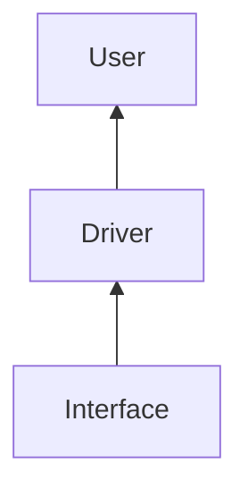
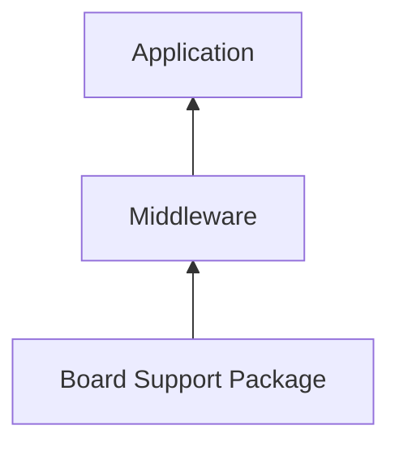

# Contributing to LibDriver

### Table of Contents

  - [Code of Conduct](#Code-of-Conduct)
  - [Contributor License Agreement](#Contributor-License-Agreement)
  - [Design of Driver](#Design-of-Driver)
  - [Code Style](#Code-Style)
  - [MISRA Compliant](#MISRA-Compliant)
  - [Comment Style](#Comment-Style)
  - [Makefile Style](#Makefile-Style)
  - [CMake Style](#CMake-Style)
  - [IDE Project Structure](#IDE-Project-Structure)
  - [Commit Messages Style](#Commit-Messages-Style)
  - [Example](#Example)
  - [Unit Test](#Unit-Test)
  - [Project](#Project)
  - [Documentation](#Documentation)

### Code of Conduct

The LibDriver has a [Code of Conduct](/CODE_OF_CONDUCT.md) to which all contributors should adhere.

### Contributor License Agreement

In order to clarify the intellectual property license granted with Contributions from any person or entity, LibDriver("LibDriver") must have a Contributor License Agreement ("CLA") on file that has been signed by each Contributor, indicating agreement to the license terms below. This license is for your protection as a Contributor as well as the protection of LibDriver; it does not change your rights to use your own Contributions for any other purpose.

You accept and agree to the following terms and conditions for Your present and future Contributions submitted to LibDriver. Except for the license granted herein to LibDriver and recipients of software distributed by LibDriver, You reserve all right, title, and interest in and to Your Contributions.

1. Definitions.

   "You" (or "Your") shall mean the copyright owner or legal entity authorized by the copyright owner that is making this Agreement with LibDriver. For legal entities, the entity making a Contribution and all other entities that control, are controlled by, or are under common control with that entity are considered to be a single Contributor. For the purposes of this definition, "control" means (i) the power, direct or indirect, to cause the direction or management of such entity, whether by contract or otherwise, or (ii) ownership of fifty percent (50%) or more of the outstanding shares, or (iii) beneficial ownership of such entity.

   "Contribution" shall mean any original work of authorship, including any modifications or additions to an existing work, that is intentionally submitted by You to LibDriver for inclusion in, or documentation of, any of the products owned or managed by LibDriver (the "Work"). For the purposes of this definition, "submitted" means any form of electronic, verbal, or written communication sent to LibDriver or its representatives, including but not limited to communication on electronic mailing lists, source code control systems, and issue tracking systems that are managed by, or on behalf of, LibDriver for the purpose of discussing and improving the Work, but excluding communication that is conspicuously marked or otherwise designated in writing by You as "Not a Contribution."

2. Grant of Copyright License. Subject to the terms and conditions of this Agreement, You hereby grant to LibDriver and to recipients of software distributed by LibDriver a perpetual, worldwide, non-exclusive, no-charge, royalty-free, irrevocable copyright license to reproduce, prepare derivative works of, publicly display, publicly perform, sublicense, and distribute Your Contributions and such derivative works.

3. Grant of Patent License. Subject to the terms and conditions of this Agreement, You hereby grant to LibDriver and to recipients of software distributed by LibDriver a perpetual, worldwide, non-exclusive, no-charge, royalty-free, irrevocable (except as stated in this section) patent license to make, have made, use, offer to sell, sell, import, and otherwise transfer the Work, where such license applies only to those patent claims licensable by You that are necessarily infringed by Your Contribution(s) alone or by combination of Your Contribution(s) with the Work to which such Contribution(s) was submitted. If any entity institutes patent litigation against You or any other entity (including a cross-claim or counterclaim in a lawsuit) alleging that your Contribution, or the Work to which you have contributed, constitutes direct or contributory patent infringement, then any patent licenses granted to that entity under this Agreement for that Contribution or Work shall terminate as of the date such litigation is filed.

4. You represent that you are legally entitled to grant the above license. If your employer(s) has rights to intellectual property that you create that includes your Contributions, you represent that you have received permission to make Contributions on behalf of that employer, that your employer has waived such rights for your Contributions to LibDriver, or that your employer has executed a separate Corporate CLA with LibDriver.

5. You represent that each of Your Contributions is Your original creation (see section 7 for submissions on behalf of others). You represent that Your Contribution submissions include complete details of any third-party license or other restriction (including, but not limited to, related patents and trademarks) of which you are personally aware and which are associated with any part of Your Contributions.

6. You are not expected to provide support for Your Contributions, except to the extent You desire to provide support. You may provide support for free, for a fee, or not at all. Unless required by applicable law or agreed to in writing, You provide Your Contributions on an "AS IS" BASIS, WITHOUT WARRANTIES OR CONDITIONS OF ANY KIND, either express or implied, including, without limitation, any warranties or conditions of TITLE, NON- INFRINGEMENT, MERCHANTABILITY, or FITNESS FOR A PARTICULAR PURPOSE.

7. Should You wish to submit work that is not Your original creation, You may submit it to LibDriver separately from any Contribution, identifying the complete details of its source and of any license or other restriction (including, but not limited to, related patents, trademarks, and license agreements) of which you are personally aware, and conspicuously marking the work as "Submitted on behalf of a third-party: [named here]".

8. You agree to notify LibDriver of any facts or circumstances of which you become aware that would make these representations inaccurate in any respect.

### Design of Driver

LibDriver adopts the separate design of driver and driver interface, the driver interface shields the differences of systems and hardwares and the driver provides a unified interface upward.



### Code Style

All code needs to follow the LibDriver code style and its content is as follows:

1. Include <stdint.h> and use int8_t, uint8_t, int16_t, uint16_t, int32_t and uint32_t instead of int and long. float, double and char are unchanged.

2. For pointer variables, put the * side close to the variable, such as "uint8_t *p".

3. All functions and variables are named in lowercase using the "x_xx_xxx" format, such as "uint8_t set_config(uint8_t config)". Function and variable naming rules are noun + verb + object.

4. Local variables are separated from the program line.

5. {}, if, while, for, etc. each occupy a line and each level of structure is separated by four spaces.

6. The program uses one tab distance between each level and uses four spaces instead of tab.

7. Interrupt or exit statements such as return and break are separated from the program by one line.

8. In a single program, the program can be divided into blocks according to functions and each function block is separated by a line.

9. Leave a blank line between each function.

10. Add a space between binary operation symbols =, +,  -,  /,  >,  <,  >=, <=,  ==, &,  |,  &&,  ||,  &=,  |=, etc.

11. Each structure, enumeration and macro definition has a blank line.

12. The internal use of the file must use the static type and add "a_" before the function name to distinguish it from external functions, such as "static uint8_t a_set_way(uint8_t way)".

13. The program design must include the return execution result and judge the execution result to deal with the error.

14. Macro definitions must be capitalized.

15. The structure is uniformly named "typedef struct xx_s()xx_t" and "xx_t" is uniformly used as the name.

16. The enumeration is uniformly named "typedef enum {}xx_t" and "xx_t" is uniformly used as the name.

17. The header file definition must use the following structure.

    ```c
    #ifndef XXX_H
    #define XXX_H
    
    #ifdef __cplusplus
    extern "C"{
    #endif
    
    #ifdef __cplusplus
    }
    #endif
    
    #endif
    ```

18. The header file should be included before extern "C".

    ```c
    #ifndef XXX_H
    #define XXX_H
    
    #include <xx.h>
    
    #ifdef __cplusplus
    extern "C"{
    #endif
    
    #ifdef __cplusplus
    }
    #endif
    
    #endif
    ```

19. Use <> for system headers and " "  for users headers.

20. Try to use the macro definition to express the length of array.

21. Global variables and static variables need to be added in front of  "g_" and "s_".

22. The unified format of macro definition function operation is "XXXX (HANDLE, FUC)", macro definitions and variables are all capitalized and there are no underscores before and after.

23. Header files only contain external declarations and structures. Do not expose internal information and define variables in header files.

24. Include only required references, redundant references should be removed.

25. The program needs to be designed in layers. The header file can only include the lower-level program in the upper-level program. It is strictly forbidden for the lower-level program to include the upper-level program. If necessary, a public interface should be defined.

26. Each .c file needs to have an .h file counterpart with the same name.

27. Header files prohibit circular dependencies.

28. A header file must be self-contained and compile independently.

29. The function can only be used by including the .h file and the use of the function by extern is strictly prohibited.

30. The program needs to be modularized and divided into multiple .c combinations.

31. Including multiple headers should be sorted by stability and ascending order.

    ```c
    #include <a.h>
    #include <b.h>
    #include <c/d.h>
    #include <c/e.h>
    #include <f.h>
    #include <product.h>
    #include <platform.h>
    ```

32. A function should complete only one function.

33. Duplicate code requires refinement of common function implementations.

34. A single line should not be too long, no more than 128 characters and a single function should not be too long. If it exceeds, it must be written in multiple lines and a new line is divided at the low-priority operator. The operator is placed at the beginning of a new line, the divided new line should be properly indented and matched with the previous line of code.

35. Function nesting should not exceed three layers.

36. For functions that can be called by multiple threads, multi-thread calling problem needs to be considered.

37. The legality of function parameters is implemented by the calling function itself and the return value is returned to the caller.

38. Unused variables, functions, etc. are deleted in time.

39. Constants should be modified with const.

40. Try to avoid using global variables and static variables in the function and pay attention to add volatile to protect the program when optimizing with -O3.

41. Check the validity of all non-parameter inputs, such as files, handle addresses, etc.

42. Don't exceed five function parameters and use structures if there are more.

43. Variable length parameter functions cannot be used except printf function.

44. In addition to common consensus abbreviations, function variables use full names whenever possible.

    ```sh
    argument: arg 
    buffer: buff 
    clock: clk 
    command: cmd 
    compare: cmp 
    configuration: cfg 
    device: dev 
    error: err 
    hexadecimal: hex 
    increment: inc
    initialize: init 
    maximum: max 
    message: msg 
    minimum: min 
    parameter: para 
    previous: prev 
    register: reg 
    semaphore: sem  
    statistic: stat 
    synchronize: sync 
    temp: tmp
    ```

45. .c and .h names are all lowercase.

46. Macro definitions don't start with an underscore.

47. Using an uninitialized value as an right value is strictly prohibited.

48. Operations defined by macros must be enclosed in parentheses.

49. If there are too many macro definition operations, you need to use "do{}while(0)" to define.

50. Array out of bounds is prohibited.

51. Disable memory leaks.

52. The else if statement must end with an else statement and the switch statement must have a default branch.

53. Functions that are called many times or frequently are defined using inline.

54. Comments should be placed above or to the right.

55. Single-line variables cannot be assigned multiple values and each line can only be assigned once.

56. Unary operators don't add spaces.

57. Assignment statements should not be written in statements such as if nor should they be used as parameters.

58. Multivariate operations bracket each part.

59. Make sure that the strings are all NULL terminated.

60. Octal is not allowed.

### MISRA Compliant

All driver sources, tests and examples must be MISRA compliant and need to be scanned with at least one software tool that claims to check code for "MISRA conformance".The scan report needs to be saved  to \misra. LibDriver uses the MISRA C:2012 specification standard and its content is as follows:

Dir 1.1 Any implementation-defined behaviour on which the output of the program depends shall be documented and understood

Category Required

------

Dir 2.1 All source files shall compile without any compilation errors

Category Required

------

Dir 3.1 All code shall be traceable to documented requirements

Category Required

------

Dir 4.1 Run-time failures shall be minimized

Category Required

------

Dir 4.2 All usage of assembly language should be documented

Category Advisory

------

Dir 4.3 Assembly language shall be encapsulated and isolated

Category Required

------

Dir 4.4 Sections of code should not be “commented out”

Category Advisory

------

Dir 4.5 Identifiers in the same name space with overlapping visibility should be typographically unambiguous

Category Advisory

------

Dir 4.6 typedefs that indicate size and signedness should be used in place of the basic numerical types

Category Advisory

------

Dir 4.7 If a function returns error information, then that error information shall be tested

Category Required

------

Dir 4.8 If a pointer to a structure or union is never dereferenced within a translation unit, then the implementation of the object should be hidden

Category Advisory

------

Dir 4.9 A function should be used in preference to a function-like macro where they are interchangeable

Category Advisory

------

Dir 4.10 Precautions shall be taken in order to prevent the contents of a header file being included more than once

Category Required

------

Dir 4.11 The validity of values passed to library functions shall be checked

Category Required

------

Dir 4.12 Dynamic memory allocation shall not be used

Category Required

------

Dir 4.13 Functions which are designed to provide operations on a resource should be called in an appropriate sequence

Category Advisory

------

Rule 1.1 The program shall contain no violations of the standard C syntax and constraints, and shall not exceed the implementation’s translation limits

Category Required

------

Rule 1.2 Language extensions should not be used

Category Advisory

------

Rule 1.3 There shall be no occurrence of undefined or critical unspecified behaviour

Category Required

------

Rule 2.1 A project shall not contain unreachable code

Category Required

------

Rule 2.2 There shall be no dead code

Category Required

------

Rule 2.3 A project should not contain unused type declarations

Category Advisory

------

Rule 2.4 A project should not contain unused tag declarations

Category Advisory

------

Rule 2.5 A project should not contain unused macro declarations

Category Advisory

------

Rule 2.6 A function should not contain unused label declarations

Category Advisory

------

Rule 2.7 There should be no unused parameters in functions

Category Advisory

------

Rule 3.1 The character sequences /* and // shall not be used within a comment

Category Required

------

Rule 3.2 Line-splicing shall not be used in // comments

Category Required

------

Rule 4.1 Octal and hexadecimal escape sequences shall be terminated

Category Required

------

Rule 4.2 Trigraphs should not be used

Category Advisory

------

Rule 5.1 External identifiers shall be distinct

Category Required

------

Rule 5.2 Identifiers declared in the same scope and name space shall be distinct

Category Required

------

Rule 5.3 An identifier declared in an inner scope shall not hide an identifier declared in an outer scope

Category Required

------

Rule 5.4 Macro identifiers shall be distinct

Category Required

------

Rule 5.5 Identifiers shall be distinct from macro names

Category Required

------

Rule 5.6 A typedef name shall be a unique identifier

Category Required

------

Rule 5.7 A tag name shall be a unique identifier

Category Required

------

Rule 5.8 Identifiers that define objects or functions with external linkage shall be unique

Category Required

------

Rule 5.9 Identifiers that define objects or functions with internal linkage should be unique

Category Advisory

------

Rule 6.1 Bit-fields shall only be declared with an appropriate type

Category Required

------

Rule 6.2 Single-bit named bit fields shall not be of a signed type

Category Required

------

Rule 7.1 Octal constants shall not be used

Category Required

------

Rule 7.2 A “u” or “U” suffix shall be applied to all integer constants that are represented in an unsigned type

Category Required

------

Rule 7.3 The lowercase character “l” shall not be used in a literal suffix

Category Required

------

Rule 7.4 A string literal shall not be assigned to an object unless the object’s type is “pointer to const-qualified char”

Category Required

------

Rule 8.1 Types shall be explicitly specified

Category Required

------

Rule 8.2 Function types shall be in prototype form with named parameters

Category Required

------

Rule 8.3 All declarations of an object or function shall use the same names and type qualifiers

Category Required

------

Rule 8.4 A compatible declaration shall be visible when an object or function with external linkage is defined

Category Required

------

Rule 8.5 An external object or function shall be declared once in one and only one file

Category Required

------

Rule 8.6 An identifier with external linkage shall have exactly one external definition

Category Required

------

Rule 8.7 Functions and objects should not be defined with external linkage if they are referenced in only one translation unit

Category Advisory

------

Rule 8.8 The static storage class specifier shall be used in all declarations of objects and functions that have internal linkage

Category Required

------

Rule 8.9 An object should be defined at block scope if its identifier only appears in a single function

Category Advisory

------

Rule 8.10 An inline function shall be declared with the static storage class

Category Required

------

Rule 8.11 When an array with external linkage is declared, its size should be explicitly specified

Category Advisory

------

Rule 8.12 Within an enumerator list, the value of an implicitly-specified enumeration constant shall be unique

Category Required

------

Rule 8.13 A pointer should point to a const-qualified type whenever possible

Category Advisory

------

Rule 8.14 The restrict type qualifier shall not be used

Category Required

------

Rule 9.1 The value of an object with automatic storage duration shall not be read before it has been set

Category Mandatory

------

Rule 9.2 The initializer for an aggregate or union shall be enclosed in braces

Category Required

------

Rule 9.3 Arrays shall not be partially initialized

Category Required

------

Rule 9.4 An element of an object shall not be initialized more than once

Category Required

------

Rule 9.5 Where designated initializers are used to initialize an array object the size of the array shall be specified explicitly

Category Required

------

Rule 10.1 Operands shall not be of an inappropriate essential type

Category Required

------

Rule 10.2 Expressions of essentially character type shall not be used inappropriately in addition and subtraction operations

Category Required

------

Rule 10.3 The value of an expression shall not be assigned to an object with a narrower essential type or of a different essential type category

Category Required

------

Rule 10.4 Both operands of an operator in which the usual arithmetic conversions are performed shall have the same essential type category

Category Required

------

Rule 10.5 The value of an expression should not be cast to an inappropriate essential type

Category Advisory

------

Rule 10.6 The value of a composite expression shall not be assigned to an object with wider essential type

Category Required

------

Rule 10.7 If a composite expression is used as one operand of an operator in which the usual arithmetic conversions are performed then the other operand shall not have wider essential type

Category Required

------

Rule 10.8 The value of a composite expression shall not be cast to a different essential type category or a wider essential type

Category Required

------

Rule 11.1 Conversions shall not be performed between a pointer to a function and any other type

Category Required

------

Rule 11.2 Conversions shall not be performed between a pointer to an incomplete type and any other type

Category Required

------

Rule 11.3 A cast shall not be performed between a pointer to object type and a pointer to a different object type

Category Required

------

Rule 11.4 A conversion should not be performed between a pointer to object and an integer type

Category Advisory

------

Rule 11.5 A conversion should not be performed from pointer to void into pointer to object 

Category Advisory

------

Rule 11.6 A cast shall not be performed between pointer to void and an arithmetic type

Category Required

------

Rule 11.7 A cast shall not be performed between pointer to object and a non-integer arithmetic type

Category Required

------

Rule 11.8 A cast shall not remove any const or volatile qualification from the type pointed to by a pointer

Category Required

------

Rule 11.9 The macro NULL shall be the only permitted form of integer null pointer constant

Category Required

------

Rule 12.1 The precedence of operators within expressions should be made explicit

Category Advisory

------

Rule 12.2 The right hand operand of a shift operator shall lie in the range zero to one less than the width in bits of the essential type of the left hand operand

Category Required

------

Rule 12.3 The comma operator should not be used

Category Advisory

------

Rule 12.4 Evaluation of constant expressions should not lead to unsigned integer wrap-around

Category Advisory

------

Rule 13.1 Initializer lists shall not contain persistent side effects

Category Required

------

Rule 13.2 The value of an expression and its persistent side effects shall be the same under all permitted evaluation orders

Category Required

------

Rule 13.3 A full expression containing an increment (++) or decrement (--) operator should have no other potential side effects other than that caused by the increment or decrement operator

Category Advisory

------

Rule 13.4 The result of an assignment operator should not be used

Category Advisory

------

Rule 13.5 The right hand operand of a logical && or || operator shall not contain persistent side effects

Category Required

------

Rule 13.6 The operand of the sizeof operator shall not contain any expression which has potential side effects

Category Mandatory

------

Rule 14.1 A loop counter shall not have essentially floating type

Category Required

------

Rule 14.2 A for loop shall be well-formed

Category Required

------

Rule 14.3 Controlling expressions shall not be invariant

Category Required

------

Rule 14.4 The controlling expression of an if statement and the controlling expression of an iteration- statement shall have essentially Boolean type

Category Required

------

Rule 15.1 The goto statement should not be used

Category Advisory

------

Rule 15.2 The goto statement shall jump to a label declared later in the same function

Category Required

------

Rule 15.3 Any label referenced by a goto statement shall be declared in the same block, or in any block enclosing the goto statement

Category Required

------

Rule 15.4 There should be no more than one break or goto statement used to terminate any iteration statement

Category Advisory

------

Rule 15.5 A function should have a single point of exit at the end

Category Advisory

------

Rule 15.6 The body of an iteration-statement or a selection-statement shall be a compound-statement

Category Required

------

Rule 15.7 All if … else if constructs shall be terminated with an else statement

Category Required

------

Rule 16.1 All switch statements shall be well-formed

Category Required

------

Rule 16.2 A switch label shall only be used when the most closely-enclosing compound statement is the body of a switch statement

Category Required

------

Rule 16.3 An unconditional break statement shall terminate every switch-clause

Category Required

------

Rule 16.4 Every switch statement shall have a default label

Category Required

------

Rule 16.5 A default label shall appear as either the first or the last switch label of a switch statement

Category Required

------

Rule 16.6 Every switch statement shall have at least two switch-clauses

Category Required

------

Rule 16.7 A switch-expression shall not have essentially Boolean type

Category Required

------

Rule 17.1 The features of <stdarg.h> shall not be used

Category Required

------

Rule 17.2 Functions shall not call themselves, either directly or indirectly

Category Required

------

Rule 17.3 A function shall not be declared implicitly

Category Mandatory

------

Rule 17.4 All exit paths from a function with non-void return type shall have an explicit return statement with an expression

Category Mandatory

------

Rule 17.5 The function argument corresponding to a parameter declared to have an array type shall have an appropriate number of elements

Category Advisory

------

Rule 17.6 The declaration of an array parameter shall not contain the static keyword between the [ ]

Category Mandatory

------

Rule 17.7 The value returned by a function having non-void return type shall be used

Category Required

------

Rule 17.8 A function parameter should not be modified

Category Advisory

------

Rule 18.1 A pointer resulting from arithmetic on a pointer operand shall address an element of the same array as that pointer operand

Category Required

------

Rule 18.2 Subtraction between pointers shall only be applied to pointers that address elements of the same array

Category Required

------

Rule 18.3 The relational operators >, >=, < and <= shall not be applied to objects of pointer type except where they point into the same object

Category Required

------

Rule 18.4 The +, -, += and -= operators should not be applied to an expression of pointer type

Category Advisory

------

Rule 18.5 Declarations should contain no more than two levels of pointer nesting

Category Advisory

------

Rule 18.6 The address of an object with automatic storage shall not be copied to another object that persists after the first object has ceased to exist

Category Required

------

Rule 18.7 Flexible array members shall not be declared

Category Required

------

Rule 18.8 Variable-length array types shall not be used

Category Required

------

Rule 19.1 An object shall not be assigned or copied to an overlapping object

Category Mandatory

------

Rule 19.2 The union keyword should not be used

Category Advisory

------

Rule 20.1 #include directives should only be preceded by preprocessor directives or comments

Category Advisory

------

Rule 20.2 The ', " or \ characters and the /* or // character sequences shall not occur in a header file name

Category Required

------

Rule 20.3 The #include directive shall be followed by either a  <filename> or "filename" sequence

Category Required

------

Rule 20.4 A macro shall not be defined with the same name as a keyword

Category Required

------

Rule 20.5 #undef should not be used

Category Advisory

------

Rule 20.6 Tokens that look like a preprocessing directive shall not occur within a macro argument

Category Required

------

Rule 20.7 Expressions resulting from the expansion of macro parameters shall be enclosed in parentheses

Category Required

------

Rule 20.8 The controlling expression of a #if or #elif preprocessing directive shall evaluate to 0 or 1

Category Required

------

Rule 20.9 All identifiers used in the controlling expression of #if or #elif preprocessing directives shall be #define’d before evaluation

Category Required

------

Rule 20.10 The # and ## preprocessor operators should not be used

Category Advisory

------

Rule 20.11 A macro parameter immediately following a # operator shall not immediately be followed by a ## operator

Category Required

------

Rule 20.12 A macro parameter used as an operand to the # or ## operators, which is itself subject to further macro replacement, shall only be used as an operand to these operators

Category Required

------

Rule 20.13 A line whose first token is # shall be a valid preprocessing directive

Category Required

------

Rule 20.14 All #else, #elif and #endif preprocessor directives shall reside in the same file as the #if,  #ifdef or #ifndef directive to which they are related

Category Required

------

Rule 21.1 #define and #undef shall not be used on a reserved identifier or reserved macro name

Category Required

------

Rule 21.2 A reserved identifier or macro name shall not be declared

Category Required

------

Rule 21.3 The memory allocation and deallocation functions of  <stdlib.h> shall not be used

Category Required

------

Rule 21.4 The standard header file <setjmp.h> shall not be used

Category Required

------

Rule 21.5 The standard header file <signal.h> shall not be used

Category Required

------

Rule 21.6 The Standard Library input/output functions shall not be used

Category Required

------

Rule 21.7 The atof, atoi, atol and atoll functions of <stdlib.h> shall not be used

Category Required

------

Rule 21.8 The library functions abort, exit, getenv and system of <stdlib.h> shall not be used

Category Required

------

Rule 21.9 The library functions bsearch and qsort of <stdlib.h> shall not be used

Category Required

------

Rule 21.10 The Standard Library time and date functions shall not be used

Category Required

------

Rule 21.11 The standard header file <tgmath.h> shall not be used

Category Required

------

Rule 21.12 The exception handling features of  <fenv.h> should not be used

Category Advisory

------

Rule 22.1 All resources obtained dynamically by means of Standard Library functions shall be explicitly released

Category Required

------

Rule 22.2 A block of memory shall only be freed if it was allocated by means of a Standard Library function

Category Mandatory

------

Rule 22.3 The same file shall not be open for read and write access at the same time on different streams

Category Required

------

Rule 22.4 There shall be no attempt to write to a stream which has been opened as read-only

Category Mandatory

------

Rule 22.5 A pointer to a FILE object shall not be dereferenced

Category Mandatory

------

Rule 22.6 The value of a pointer to a FILE shall not be used after the associated stream has been closed

Category Mandatory

### Comment Style

All code needs to be commented and the comment style is as follows:

1. Comments must be in English.

2. Use /* */ for single-line comments. If you write on a function, you need to have a blank line with the above program. Multi-line comments use the following style.

    ```c
    /*
     * xxx...xx..xxx.xxx
     * xxx..xx..xx.xx.xxx
     */
    ```

3. Each function needs to include @brief (brief description), @param[in], @param[out], @param[int, out] (parameter description), @return (return description), and @note (note description), in the order of @brief, @param, @return, and @note. Among them, @return needs to indicate the meaning of each return value.

4. @param[in], @param[out], @param[int, out] need to specify the direction of parameter passing, the format is parameter name + meaning of the parameter, if not, do not write.

5. If there are several types of return values, write several return values. The format is return value + meaning of the return value. If there is no return value, do not write.

6. Enumerations require @brief, and add /**< */ enumeration type description to the right of each enumeration.

7. The structure needs @brief, and add /**< */ structure type description to the right of each member.

8. Macro-defined functions are annotated like regular functions.

9. Macro definition requires @brief, and add /**< */ function description on the right.

10. Functions need to be grouped with annotations and subgrouped if necessary.

    ```c
    /**
     * @defgroup tag name
     * @brief xxx modules
     * @{
     */

    /**
     * @}
     */
    ```

11. The file header needs to include copyright, license, @file, @brief, @version, @author, @data and modification history.

    ```c
    /**
     * Copyright (c) 2015 - present XXXXX All rights reserved
     * 
     * The MIT License (MIT)
     *
     * Permission is hereby granted, free of charge, to any person obtaining a copy
     * of this software and associated documentation files (the "Software"), to deal
     * in the Software without restriction, including without limitation the rights
     * to use, copy, modify, merge, publish, distribute, sublicense, and/or sell
     * copies of the Software, and to permit persons to whom the Software is
     * furnished to do so, subject to the following conditions:
     *
     * The above copyright notice and this permission notice shall be included in all
     * copies or substantial portions of the Software.
     *
     * THE SOFTWARE IS PROVIDED "AS IS", WITHOUT WARRANTY OF ANY KIND, EXPRESS OR
     * IMPLIED, INCLUDING BUT NOT LIMITED TO THE WARRANTIES OF MERCHANTABILITY,
     * FITNESS FOR A PARTICULAR PURPOSE AND NONINFRINGEMENT. IN NO EVENT SHALL THE
     * AUTHORS OR COPYRIGHT HOLDERS BE LIABLE FOR ANY CLAIM, DAMAGES OR OTHER
     * LIABILITY, WHETHER IN AN ACTION OF CONTRACT, TORT OR OTHERWISE, ARISING FROM,
     * OUT OF OR IN CONNECTION WITH THE SOFTWARE OR THE USE OR OTHER DEALINGS IN THE
     * SOFTWARE. 
     *
     * @file      xxx.h
     * @brief     xxx
     * @version   x.x.x
     * @author    xxx
     * @date      xxxx-x-xx
     *
     * <h3>history</h3>
     * <table>
     * <tr><th>Date        <th>Version  <th>Author   <th>Description
     * <tr><td>xxxx/xx/xx  <td>x.x      <td>xxx      <td>xxx
     * <tr><td>xxxx/xx/xx  <td>x.x      <td>xxx      <td>xxx
     * </table>
     */
    ```

12. The home page needs to be written separately in a mainpage.h, including @mainpage, @brief, @version, @author, historical description, copyright and license.

    ```c
    /**
     * @mainpage  xxx
     * @brief     xxx
     * @version   x.x.x
     * @author    xx
     *
     * <h3>history</h3>
     * <table>
     * <tr><th>Date        <th>Version  <th>Author   <th>Description
     * <tr><td>xxxx/xx/xx  <td>x.x      <td>xxx      <td>xxx
     * <tr><td>xxxx/xx/xx  <td>x.x      <td>xxx      <td>xxx
     * </table> 
     *
     * <h3><center>Copyright (C) XXXXX
     * All rights reserved.</center></h3>
     *
     * The MIT License (MIT)
     *
     * Permission is hereby granted, free of charge, to any person obtaining a copy
     * of this software and associated documentation files (the "Software"), to deal
     * in the Software without restriction, including without limitation the rights
     * to use, copy, modify, merge, publish, distribute, sublicense, and/or sell
     * copies of the Software, and to permit persons to whom the Software is
     * furnished to do so, subject to the following conditions:
     *
     * The above copyright notice and this permission notice shall be included in all
     * copies or substantial portions of the Software.
     *
     * THE SOFTWARE IS PROVIDED "AS IS", WITHOUT WARRANTY OF ANY KIND, EXPRESS OR
     * IMPLIED, INCLUDING BUT NOT LIMITED TO THE WARRANTIES OF MERCHANTABILITY,
     * FITNESS FOR A PARTICULAR PURPOSE AND NONINFRINGEMENT. IN NO EVENT SHALL THE
     * AUTHORS OR COPYRIGHT HOLDERS BE LIABLE FOR ANY CLAIM, DAMAGES OR OTHER
     * LIABILITY, WHETHER IN AN ACTION OF CONTRACT, TORT OR OTHERWISE, ARISING FROM,
     * OUT OF OR IN CONNECTION WITH THE SOFTWARE OR THE USE OR OTHER DEALINGS IN THE
     * SOFTWARE. 
     */
    ```

### Makefile Style

Makefile needs to follow the LibDriver Makefile style and its content is as follows:

1. Each Makefile must contain copyright information.

   ```makefile
   #
   # Copyright (c) 2015 - present XXX All rights reserved
   #
   # The MIT License (MIT)
   #
   # Permission is hereby granted, free of charge, to any person obtaining a copy
   # of this software and associated documentation files (the "Software"), to deal
   # in the Software without restriction, including without limitation the rights
   # to use, copy, modify, merge, publish, distribute, sublicense, and/or sell
   # copies of the Software, and to permit persons to whom the Software is
   # furnished to do so, subject to the following conditions:
   #
   # The above copyright notice and this permission notice shall be included in all
   # copies or substantial portions of the Software.
   #
   # THE SOFTWARE IS PROVIDED "AS IS", WITHOUT WARRANTY OF ANY KIND, EXPRESS OR
   # IMPLIED, INCLUDING BUT NOT LIMITED TO THE WARRANTIES OF MERCHANTABILITY,
   # FITNESS FOR A PARTICULAR PURPOSE AND NONINFRINGEMENT. IN NO EVENT SHALL THE
   # AUTHORS OR COPYRIGHT HOLDERS BE LIABLE FOR ANY CLAIM, DAMAGES OR OTHER
   # LIABILITY, WHETHER IN AN ACTION OF CONTRACT, TORT OR OTHERWISE, ARISING FROM,
   # OUT OF OR IN CONNECTION WITH THE SOFTWARE OR THE USE OR OTHER DEALINGS IN THE
   # SOFTWARE.
   #
   ```

2. Each command in the Makefile must contain English comments.

3. The comment should be above the command, the format is # + space + comment.

4. There should be a blank line between every two commands.

5. Makefile is placed in the root directory of the source code.

6. Compilation should include version, application name, static library name, dynamic library name, installation directory (header files, static dynamic library and binary files), compiler, etc.

   ```makefile
   # set the project version
   VERSION := 2.1.0
   
   # set the application name
   APP_NAME := demo
   
   # set the shared libraries name
   SHARED_LIB_NAME := libdemo.so
   
   # set the static libraries name
   STATIC_LIB_NAME := libdemo.a
   
   # set the install directories
   INSTL_DIRS := /usr/local
   
   # set the include directories
   INC_INSTL_DIRS := $(INSTL_DIRS)/include/$(APP_NAME)
   
   # set the library directories
   LIB_INSTL_DIRS := $(INSTL_DIRS)/lib
   
   # set the bin directories
   BIN_INSTL_DIRS := $(INSTL_DIRS)/bin
   
   # set the compiler
   CC := gcc
   
   # set the ar tool
   AR := ar
   ```

7. Dependent libraries are prioritized to use pkg-config to discover and set the environment and you can also directly set dependent libs and include header file directories.

   ```makefile
   # set the packages name
   PKGS := libcurl opencv4
   
   # set the pck-config header directories
   LIB_INC_DIRS := $(shell pkg-config --cflags $(PKGS))
   
   # set the linked libraries
   LIBS := -lm \
           -lz
   
   # add the linked libraries
   LIBS += $(shell pkg-config --libs $(PKGS))
   ```

8. Compilation definition LIB_INC_DIRS is a collection of dependent library header file directories, LIBS is a collection of dependent libraries, INC_DIRS is a collection of compiled source file directories, INSTL_INCS is a collection of installation files, SRCS is a collection of compiled source files, and MAIN is a collection of compiled executable program source files.

   ```makefile
   # set the pck-config header directories
   LIB_INC_DIRS := $(shell pkg-config --cflags $(PKGS))
   
   # set the linked libraries
   LIBS := -lm \
           -lz
   
   # add the linked libraries
   LIBS += $(shell pkg-config --libs $(PKGS))
   
   # set all header directories
   INC_DIRS := -I ./src \
               -I ./interface \
               -I ./example \
               -I ./test
   
   # add the linked libraries header directories
   INC_DIRS += $(LIB_INC_DIRS)
   
   # set the installing headers
   INSTL_INCS := $(wildcard ./src/*.h) \
               $(wildcard ./interface/*.h) \
               $(wildcard ./example/*.h) \
               $(wildcard ./test/*.h)
   
   # set all sources files
   SRCS := $(wildcard ./src/*.c) \
           $(wildcard ./interface/*.c) \
           $(wildcard ./example/*.c) \
           $(wildcard ./test/*.c)
   
   # set the main source
   MAIN := $(wildcard ./project/main.c) \
           $(SRCS)
   ```

9. Macro definitions are defined using DEFS and compilation flags are defined using CFLAGS.

   ```makefile
   # set the definitions
   DEFS := -D MATH_CONFIG_USE_HARDWARE_BLAS=MATH_CONFIG_BLAS_HARDWARE_ACCELERATION_INTEL_MKL \
           -D MATH_TEST
   
   # set flags of the compiler
   CFLAGS := -O3 \
           -DNDEBUG
   ```

10. Any target needs to be protected by .PHONY.

11. Application, dynamic library and static library templates are as follows.

    ```makefile
    # set all .PHONY
    .PHONY: all
    
    # set the output list
    all: $(APP_NAME) $(SHARED_LIB_NAME).$(VERSION) $(STATIC_LIB_NAME) 
    
    # set the main app
    $(APP_NAME) : $(MAIN)
                $(CC) $(CFLAGS) $(DEFS) $^ $(INC_DIRS) $(LIBS) -o $@
    
    # set the shared lib
    $(SHARED_LIB_NAME).$(VERSION) : $(SRCS)
                                    $(CC) $(CFLAGS) -shared -fPIC $(DEFS) $^ $(INC_DIRS) $(LIBS) -o $@
    
    # set the *.o for the static libraries
    OBJS := $(patsubst %.c, %.o, $(SRCS))
    
    # set the static lib
    $(STATIC_LIB_NAME) : $(OBJS)
                        $(AR) -r $@ $^
    
    # .*o used by the static lib
    $(OBJS) : $(SRCS)
            $(CC) $(CFLAGS) -c $(DEFS) $^ $(INC_DIRS) -o $@
    ```

12. Install, uninstall and clear templates are as follows.

    ```makefile
    # set install .PHONY
    .PHONY: install
    
    # install files
    install :
            $(shell if [ ! -d $(INC_INSTL_DIRS) ]; then mkdir $(INC_INSTL_DIRS); fi;)
            cp -rv $(INSTL_INCS) $(INC_INSTL_DIRS)
            cp -rv $(SHARED_LIB_NAME).$(VERSION) $(LIB_INSTL_DIRS)
            ln -sf $(LIB_INSTL_DIRS)/$(SHARED_LIB_NAME).$(VERSION) $(LIB_INSTL_DIRS)/$(SHARED_LIB_NAME)
            cp -rv $(STATIC_LIB_NAME) $(LIB_INSTL_DIRS)
            cp -rv $(APP_NAME) $(BIN_INSTL_DIRS)
    
    # set install .PHONY
    .PHONY: uninstall
    
    # uninstall files
    uninstall :
            rm -rf $(INC_INSTL_DIRS)
            rm -rf $(LIB_INSTL_DIRS)/$(SHARED_LIB_NAME).$(VERSION)
            rm -rf $(LIB_INSTL_DIRS)/$(SHARED_LIB_NAME)
            rm -rf $(LIB_INSTL_DIRS)/$(STATIC_LIB_NAME) 
            rm -rf $(BIN_INSTL_DIRS)/$(APP_NAME)
    
    # set clean .PHONY
    .PHONY: clean
    
    # clean the project
    clean :
            rm -rf $(APP_NAME) $(SHARED_LIB_NAME).$(VERSION) $(STATIC_LIB_NAME)
    ```

### CMake Style

CMakeLists.txt needs to follow the LibDriver CMake style and its content is as follows:

1. Each CMakeLists.txt must contain copyright information.

   ```cmake
   #
   # Copyright (c) 2015 - present XXX All rights reserved
   #
   # The MIT License (MIT)
   #
   # Permission is hereby granted, free of charge, to any person obtaining a copy
   # of this software and associated documentation files (the "Software"), to deal
   # in the Software without restriction, including without limitation the rights
   # to use, copy, modify, merge, publish, distribute, sublicense, and/or sell
   # copies of the Software, and to permit persons to whom the Software is
   # furnished to do so, subject to the following conditions:
   #
   # The above copyright notice and this permission notice shall be included in all
   # copies or substantial portions of the Software.
   #
   # THE SOFTWARE IS PROVIDED "AS IS", WITHOUT WARRANTY OF ANY KIND, EXPRESS OR
   # IMPLIED, INCLUDING BUT NOT LIMITED TO THE WARRANTIES OF MERCHANTABILITY,
   # FITNESS FOR A PARTICULAR PURPOSE AND NONINFRINGEMENT. IN NO EVENT SHALL THE
   # AUTHORS OR COPYRIGHT HOLDERS BE LIABLE FOR ANY CLAIM, DAMAGES OR OTHER
   # LIABILITY, WHETHER IN AN ACTION OF CONTRACT, TORT OR OTHERWISE, ARISING FROM,
   # OUT OF OR IN CONNECTION WITH THE SOFTWARE OR THE USE OR OTHER DEALINGS IN THE
   # SOFTWARE.
   #
   ```

2. Each command in CMakeLists.txt must contain English comments.

3. The comment should be above the command, the format is # + space + comment.

4. There should be a blank line between every two commands.

5. The CMakeList.txt is placed in the root directory of the source code and a cmake folder is created to store the VERSION, config.cmake.in and uninstall.cmake files.

6. Each CMake project needs to create a compiled version file named VERSION under the cmake/ folder.

   ```cmake
   1.0.0
   ```

7. Each project needs to include CMake minimum version requirements, set the project name (writing language), set the version number, set the C/C++ language standard, set the compile flag and set the debug or release statement.

   ```cmake
   # set the cmake minimum version
   cmake_minimum_required(VERSION 3.0)
   
   # set the project name and language
   project(demo C CXX)
   
   # read the version from files
   file(READ ${CMAKE_CURRENT_SOURCE_DIR}/cmake/VERSION ${CMAKE_PROJECT_NAME}_VERSION)
   
   # set the project version
   set(PROJECT_VERSION ${${CMAKE_PROJECT_NAME}_VERSION})
   
   # set c standard c99
   set(CMAKE_C_STANDARD 99)
   
   # enable c standard required
   set(CMAKE_C_STANDARD_REQUIRED True)
   
   # set c++ standard c++11
   set(CMAKE_CXX_STANDARD 11)
   
   # enable c++ standard required
   set(CMAKE_CXX_STANDARD_REQUIRED True)
   
   # set debug level
   # set(CMAKE_BUILD_TYPE Debug)
   
   # set the debug flags of c
   # set(CMAKE_C_FLAGS_DEBUG "-O0 -g")
   
   # set the debug flags of c++
   # set(CMAKE_CXX_FLAGS_DEBUG "-O0 -g")
   
   # set release level
   set(CMAKE_BUILD_TYPE Release)
   
   # set the release flags of c
   set(CMAKE_C_FLAGS_RELEASE "-O3 -DNDEBUG")
   
   # set the release flags of c++
   set(CMAKE_CXX_FLAGS_RELEASE "-O3 -DNDEBUG")
   ```

8. To include the reference library, you must first include CMakePackageConfigHelpers and add "find_package(PkgConfig REQUIRED)". After discovering the package command, you need to add all discovered INCLUDE_DIRS to the collection LIB_INC_DIRS and all discovered LIBRARIES to the collection LIBS. 

   ```cmake
   # include cmake package config helpers
   include(CMakePackageConfigHelpers)
   
   # find the pkgconfig and use this tool to find the third party packages
   find_package(PkgConfig REQUIRED)
   
   # find the linked libraries
   find_package(OpenCV REQUIRED)
   
   # find the third party packages with pkgconfig
   pkg_search_module(GSL REQUIRED gsl)
   
   # include all library header directories
   set(LIB_INC_DIRS
       ${OpenCV_INCLUDE_DIRS}
       ${GSL_INCLUDE_DIRS}
      )
   
   # include all linked libraries
   set(LIBS
       ${OpenCV_LIBRARIES}
       ${GSL_LIBRARIES}
      )
   ```

9. Define the CMake variable LIB_INC_DIRS as the directory of all found library header files, LIBS as the name directory of all found libraries, INC_DIRS as the directory of all header files required for compilation (need to include ${LIB_INC_DIRS}), INSTL_INCS as the name of all header files that need to be installed , SRCS as the name of all source files required to generate libraries and MAIN as the collection of source files required to generate the program.

   ```cmake
   # include all library header directories
   set(LIB_INC_DIRS
       ${OpenCV_INCLUDE_DIRS}
       ${GSL_INCLUDE_DIRS}
      )
   
   # include all linked libraries
   set(LIBS
       ${OpenCV_LIBRARIES}
       ${GSL_LIBRARIES}
      )
   
   # include all header directories
   set(INC_DIRS
       ${LIB_INC_DIRS}
       ${CMAKE_CURRENT_SOURCE_DIR}/src
       ${CMAKE_CURRENT_SOURCE_DIR}/interface
       ${CMAKE_CURRENT_SOURCE_DIR}/example
       ${CMAKE_CURRENT_SOURCE_DIR}/test
      )
   
   # include all installed headers
   file(GLOB INSTL_INCS
        ${CMAKE_CURRENT_SOURCE_DIR}/src/*.h
        ${CMAKE_CURRENT_SOURCE_DIR}/interface/*.h
        ${CMAKE_CURRENT_SOURCE_DIR}/example/*.h
        ${CMAKE_CURRENT_SOURCE_DIR}/test/*.h
       )
   
   # include all sources files
   file(GLOB SRCS
        ${CMAKE_CURRENT_SOURCE_DIR}/src/*.c
        ${CMAKE_CURRENT_SOURCE_DIR}/interface/*.c
        ${CMAKE_CURRENT_SOURCE_DIR}/example/*.c
        ${CMAKE_CURRENT_SOURCE_DIR}/test/*.c
       )
   
   # include executable source
   file(GLOB MAIN
        ${CMAKE_CURRENT_SOURCE_DIR}/project/main.c
        ${SRCS}
       )
   ```

10. The static library needs to set the version number, add "_static" at the end of the generation, and finally use the renaming function to name it.

    ```cmake
    # enable output as a static library
    add_library(${CMAKE_PROJECT_NAME}_static STATIC ${SRCS})
    
    # add the definitions
    target_compile_definitions(${CMAKE_PROJECT_NAME}_static PRIVATE TEST_LIB_STATIC_DEF)
    
    # set the static library include directories
    target_include_directories(${CMAKE_PROJECT_NAME}_static PRIVATE ${INC_DIRS})
    
    # rename as ${CMAKE_PROJECT_NAME}
    set_target_properties(${CMAKE_PROJECT_NAME}_static PROPERTIES OUTPUT_NAME ${CMAKE_PROJECT_NAME})
    
    # don't delete ${CMAKE_PROJECT_NAME} libs
    set_target_properties(${CMAKE_PROJECT_NAME}_static PROPERTIES CLEAN_DIRECT_OUTPUT 1)
    
    # set the static library version
    set_target_properties(${CMAKE_PROJECT_NAME}_static PROPERTIES VERSION ${${CMAKE_PROJECT_NAME}_VERSION})
    ```

11. The dynamic library needs to set the version number, set the PUBLIC_HEADER installation file and set the link libraries.

    ```cmake
    # enable output as a dynamic library
    add_library(${CMAKE_PROJECT_NAME} SHARED ${SRCS})
    
    # add the definitions
    target_compile_definitions(${CMAKE_PROJECT_NAME} PRIVATE TEST_LIB_DEF)
    
    # set the executable program include directories
    target_include_directories(${CMAKE_PROJECT_NAME}
                               PUBLIC $<INSTALL_INTERFACE:include/${CMAKE_PROJECT_NAME}>
                               PRIVATE ${INC_DIRS}
                              )
    
    # set the dynamic library link libraries
    target_link_libraries(${CMAKE_PROJECT_NAME}
                          ${LIBS}
                         )
    
    # rename as ${CMAKE_PROJECT_NAME}
    set_target_properties(${CMAKE_PROJECT_NAME} PROPERTIES OUTPUT_NAME ${CMAKE_PROJECT_NAME})
    
    # don't delete ${CMAKE_PROJECT_NAME} libs
    set_target_properties(${CMAKE_PROJECT_NAME} PROPERTIES CLEAN_DIRECT_OUTPUT 1)
    
    # include the public header
    set_target_properties(${CMAKE_PROJECT_NAME} PROPERTIES PUBLIC_HEADER "${INSTL_INCS}")
    
    # set the dynamic library version
    set_target_properties(${CMAKE_PROJECT_NAME} PROPERTIES VERSION ${${CMAKE_PROJECT_NAME}_VERSION})
    ```

12. Executable programs needs to set up link libraries.

    ```cmake
    # enable the executable program
    add_executable(${CMAKE_PROJECT_NAME}_exe ${MAIN})
    
    # add the definitions
    target_compile_definitions(${CMAKE_PROJECT_NAME}_exe PRIVATE TEST_EXE_DEF=1)
    
    # set the executable program include directories
    target_include_directories(${CMAKE_PROJECT_NAME}_exe PRIVATE ${INC_DIRS})
    
    # set the executable program link libraries
    target_link_libraries(${CMAKE_PROJECT_NAME}_exe
                          ${LIBS}
                          m
                         )
                         
    # rename as ${CMAKE_PROJECT_NAME}
    set_target_properties(${CMAKE_PROJECT_NAME}_exe PROPERTIES OUTPUT_NAME ${CMAKE_PROJECT_NAME})
    
    # don't delete ${CMAKE_PROJECT_NAME} exe
    set_target_properties(${CMAKE_PROJECT_NAME}_exe PROPERTIES CLEAN_DIRECT_OUTPUT 1)  
    ```

13. File installation needs to set header files, dynamic libraries, static libraries and executable programs.

    ```cmake
    # install the binary
    install(TARGETS ${CMAKE_PROJECT_NAME}_exe
            RUNTIME DESTINATION bin
           )
    
    # install the static library
    install(TARGETS ${CMAKE_PROJECT_NAME}_static
            ARCHIVE DESTINATION lib
           )
    
    # install the dynamic library
    install(TARGETS ${CMAKE_PROJECT_NAME}
            EXPORT ${CMAKE_PROJECT_NAME}-targets
            LIBRARY DESTINATION lib
            PUBLIC_HEADER DESTINATION include/${CMAKE_PROJECT_NAME}
           )
    ```

14. In order for other CMake projects to use the generated library directly, a CMake package discovery file needs to be generated with the help of config.cmake.in.

    ```cmake
    # make the cmake config file
    configure_package_config_file(${CMAKE_CURRENT_SOURCE_DIR}/cmake/config.cmake.in
                                  ${CMAKE_CURRENT_BINARY_DIR}/cmake/${CMAKE_PROJECT_NAME}-config.cmake
                                  INSTALL_DESTINATION cmake
                                 )
    
    # write the cmake config version
    write_basic_package_version_file(${CMAKE_CURRENT_BINARY_DIR}/cmake/${CMAKE_PROJECT_NAME}-config-version.cmake
                                     VERSION ${PACKAGE_VERSION}
                                     COMPATIBILITY AnyNewerVersion
                                    )
    
    # install the cmake files
    install(FILES "${CMAKE_CURRENT_BINARY_DIR}/cmake/${CMAKE_PROJECT_NAME}-config.cmake"
                  "${CMAKE_CURRENT_BINARY_DIR}/cmake/${CMAKE_PROJECT_NAME}-config-version.cmake"
            DESTINATION cmake
           )
    
    # set the export items
    install(EXPORT ${CMAKE_PROJECT_NAME}-targets 
            DESTINATION cmake
           )
    ```
    The following config.cmake.in is a reference template. It needs to add "find_package" check and the others do not need to be modified.
    ```cmake
    #
    # Copyright (c) 2015 - present XXX All rights reserved
    #
    # The MIT License (MIT)
    #
    # Permission is hereby granted, free of charge, to any person obtaining a copy
    # of this software and associated documentation files (the "Software"), to deal
    # in the Software without restriction, including without limitation the rights
    # to use, copy, modify, merge, publish, distribute, sublicense, and/or sell
    # copies of the Software, and to permit persons to whom the Software is
    # furnished to do so, subject to the following conditions:
    #
    # The above copyright notice and this permission notice shall be included in all
    # copies or substantial portions of the Software.
    #
    # THE SOFTWARE IS PROVIDED "AS IS", WITHOUT WARRANTY OF ANY KIND, EXPRESS OR
    # IMPLIED, INCLUDING BUT NOT LIMITED TO THE WARRANTIES OF MERCHANTABILITY,
    # FITNESS FOR A PARTICULAR PURPOSE AND NONINFRINGEMENT. IN NO EVENT SHALL THE
    # AUTHORS OR COPYRIGHT HOLDERS BE LIABLE FOR ANY CLAIM, DAMAGES OR OTHER
    # LIABILITY, WHETHER IN AN ACTION OF CONTRACT, TORT OR OTHERWISE, ARISING FROM,
    # OUT OF OR IN CONNECTION WITH THE SOFTWARE OR THE USE OR OTHER DEALINGS IN THE
    # SOFTWARE.
    #
    
    # set the package init
    @PACKAGE_INIT@
    
    # include dependency macro
    include(CMakeFindDependencyMacro)
    
    # find the pkgconfig and use this tool to find the third party packages
    find_package(PkgConfig REQUIRED)
    
    # find the third party packages with pkgconfig
    pkg_search_module(GPIOD REQUIRED xxx)
    
    # include the cmake targets
    include(${CMAKE_CURRENT_LIST_DIR}/@CMAKE_PROJECT_NAME@-targets.cmake)
    
    # get the include header directories
    get_target_property(@CMAKE_PROJECT_NAME@_INCLUDE_DIRS @CMAKE_PROJECT_NAME@ INTERFACE_INCLUDE_DIRECTORIES)
    
    # get the library directories
    get_target_property(@CMAKE_PROJECT_NAME@_LIBRARIES @CMAKE_PROJECT_NAME@ IMPORTED_LOCATION_RELEASE)
    ```

15. In order to uninstall the installation files, the uninstall custom command needs to be added with the help of uninstall.cmake. 

    ```cmake
    # add uninstall command
    add_custom_target(uninstall
                      COMMAND ${CMAKE_COMMAND} -P ${CMAKE_CURRENT_SOURCE_DIR}/cmake/uninstall.cmake
                     )
    ```

    The following uninstall.cmake is an uninstall template.

    ```cmake
    #
    # Copyright (c) 2015 - present LibDriver All rights reserved
    #
    # The MIT License (MIT)
    #
    # Permission is hereby granted, free of charge, to any person obtaining a copy
    # of this software and associated documentation files (the "Software"), to deal
    # in the Software without restriction, including without limitation the rights
    # to use, copy, modify, merge, publish, distribute, sublicense, and/or sell
    # copies of the Software, and to permit persons to whom the Software is
    # furnished to do so, subject to the following conditions:
    #
    # The above copyright notice and this permission notice shall be included in all
    # copies or substantial portions of the Software.
    #
    # THE SOFTWARE IS PROVIDED "AS IS", WITHOUT WARRANTY OF ANY KIND, EXPRESS OR
    # IMPLIED, INCLUDING BUT NOT LIMITED TO THE WARRANTIES OF MERCHANTABILITY,
    # FITNESS FOR A PARTICULAR PURPOSE AND NONINFRINGEMENT. IN NO EVENT SHALL THE
    # AUTHORS OR COPYRIGHT HOLDERS BE LIABLE FOR ANY CLAIM, DAMAGES OR OTHER
    # LIABILITY, WHETHER IN AN ACTION OF CONTRACT, TORT OR OTHERWISE, ARISING FROM,
    # OUT OF OR IN CONNECTION WITH THE SOFTWARE OR THE USE OR OTHER DEALINGS IN THE
    # SOFTWARE.
    #
    
    # check the install_manifest.txt
    if(NOT EXISTS "${CMAKE_CURRENT_BINARY_DIR}/install_manifest.txt")
        # output the error
        message(FATAL_ERROR "cannot find install manifest: ${CMAKE_CURRENT_BINARY_DIR}/install_manifest.txt")
    endif()
    
    # read install_manifest.txt to uninstall_list
    file(READ "${CMAKE_CURRENT_BINARY_DIR}/install_manifest.txt" ${CMAKE_PROJECT_NAME}_uninstall_list)
    
    # replace '\n' to ';'
    string(REGEX REPLACE "\n" ";" ${CMAKE_PROJECT_NAME}_uninstall_list "${${CMAKE_PROJECT_NAME}_uninstall_list}")
    
    # uninstall the list files
    foreach(${CMAKE_PROJECT_NAME}_uninstall_list ${${CMAKE_PROJECT_NAME}_uninstall_list})
        # if a link or a file
        if(IS_SYMLINK "$ENV{DESTDIR}${${CMAKE_PROJECT_NAME}_uninstall_list}" OR EXISTS "$ENV{DESTDIR}${${CMAKE_PROJECT_NAME}_uninstall_list}")
            # delete the file
            execute_process(COMMAND ${CMAKE_COMMAND} -E remove ${${CMAKE_PROJECT_NAME}_uninstall_list}
                            RESULT_VARIABLE rm_retval
                           )
            
            # check the retval
            if(NOT "${rm_retval}" STREQUAL 0)
                # output the error
                message(FATAL_ERROR "failed to remove file: '${${CMAKE_PROJECT_NAME}_uninstall_list}'.")
            else()
                # uninstalling files
                message(STATUS "uninstalling: $ENV{DESTDIR}${${CMAKE_PROJECT_NAME}_uninstall_list}")
            endif()
        else()
            # output the error
            message(STATUS "file: $ENV{DESTDIR}${${CMAKE_PROJECT_NAME}_uninstall_list} does not exist.")
        endif()
    endforeach()
    ```

16. Unit tests need to include CTest, set test commands and result regular expressions.

    ```  cmake
    #include ctest module
    include(CTest)
    
    # creat a test
    add_test(NAME ${CMAKE_PROJECT_NAME}_test_1 COMMAND ${CMAKE_PROJECT_NAME}_exe -p)
    
    # set the pass regular expression
    set_tests_properties(${CMAKE_PROJECT_NAME}_test_1 PROPERTIES PASS_REGULAR_EXPRESSION "\n")
    ```

17. To package the installation program, you need to modify the contact information, modify the package description, set the CPU architecture and set the dependent packages.

    ```cmake
    # set the cpack package name
    set(CPACK_PACKAGE_NAME ${PROJECT_NAME})
    
    # set the package version
    set(CPACK_PACKAGE_VERSION ${PROJECT_VERSION})
    
    # set the package contact
    set(CPACK_PACKAGE_CONTACT "xxxx@xxx.com")
    
    # set the package description
    set(CPACK_PACKAGE_DESCRIPTION "cpack demo program")
    
    # deb output
    set(CPACK_GENERATOR "DEB")
    
    # set the package maintainer
    set(CPACK_DEBIAN_PACKAGE_MAINTAINER "XXX")
    
    # set the cpu type
    set(CPACK_DEBIAN_PACKAGE_ARCHITECTURE "armhf")
    
    # set the package name
    set(CPACK_DEBIAN_FILE_NAME ${CMAKE_PROJECT_NAME}_${PROJECT_VERSION}_${CPACK_DEBIAN_PACKAGE_ARCHITECTURE}.deb)
    
    # set the package depends
    set(CPACK_DEBIAN_PACKAGE_DEPENDS "libc6")
    
    # .tar.gz output
    # set(CPACK_GENERATOR TGZ)
    
    # set the package name
    # set(CPACK_PACKAGE_FILE_NAME ${CMAKE_PROJECT_NAME}_${PROJECT_VERSION})
    
    # include the CPack
    include(CPack)
    ```

### IDE Project Structure

The IDE project of LibDriver needs to have a good structure. Each project should be built in the order of board support package, middleware and application structure. Higher level code can use a lower level code, but lower level code can't use higher level code.



### Commit Messages Style

1. For each git commit, the commit message includes three parts: header, body and footer.

    ```shell
    <type>(<scope>): <subject>
    
    # skip a line
    
    <body>
    
    # skip a line
    
    ...
    
    <footer>
    
    ...
    
    ```

    Among them, header is required and body and footer can be omitted. Regardless of the section, no line should exceed 100 characters and this is to avoid the appearance of automatic line wrapping.

2. The header section has only one line including three fields:  type(required),  scope(optional) and subject(required). If the type is feat and fix, the commit will definitely appear in CHANGLOG. 

    "type" is used to describe the type of commit and only the following identifiers are allowed:

    - feat - new features
    - fix - patch the vulnerability
    - docs - documentation comments
    - style - format change
    - refactor - refactor
    - test - add test
    - chore - changes to the build process or auxiliary tools
    - perf - performance optimization
    - build - package
    - revert - undo the last change

    "scope" is used to illustrate the scope of commit influence, such as data layer, control layer, view layer and so on.

    "subject" is a short description of the commit with no more than 50 characters. Start with a verb and use the first-person present tense (such as change, not changed or changes). The first letter is lowercase and there is no period at the end.

3. The body part is a detailed description of this commit which can be divided into multiple lines. It should explain the motivation for the code change and the comparison with previous behaviors.

4. The footer section is only used in three cases:

    - incompatible changes
    - close issue
    - revert

### Example

All drivers need to provide complete examples including all functions of the chip.In the example, all chip configuration needs to use macro definition configuration.

### Unit Test

Unit test is an important way to verify the quality of the driver and the unit test should include all functions test of the chip. (register read test, basic function test and advanced function test, etc.)

### Project

All projects of LibDriver need to have a good structure. Each project should be built in the order of board support package, middleware and application structure.Every project should ensure stable operation under -O3 optimization. Each project should support command line debugging and running.

### Documentation

1. All drivers need to be annotated and generate the doxygen documentation.
2. Each project needs to write detailed documentation, including but not limited to: pin connection, project compilation method, command line instructions, etc.
